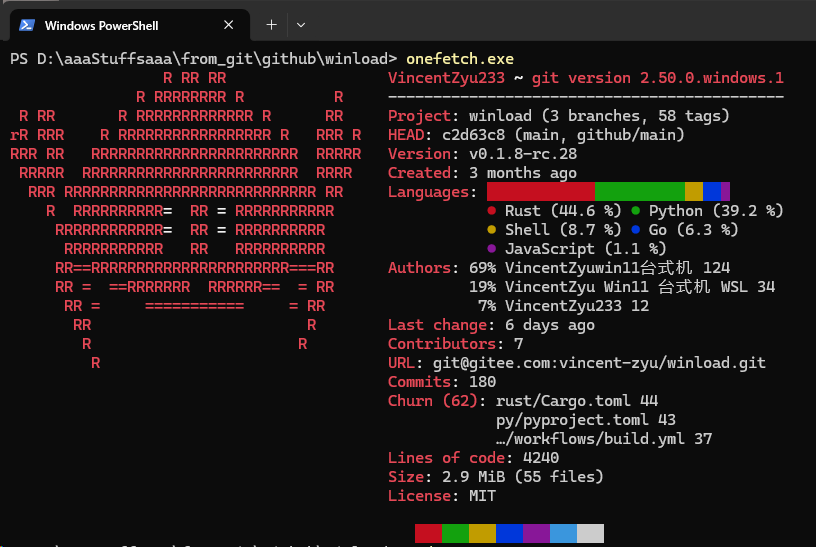
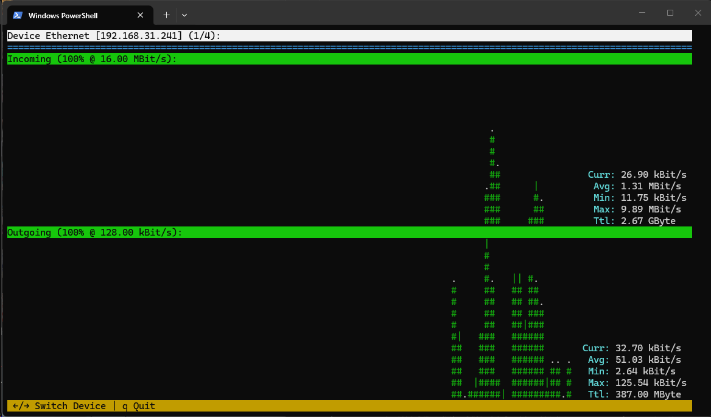
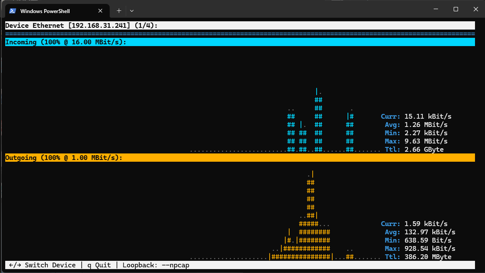
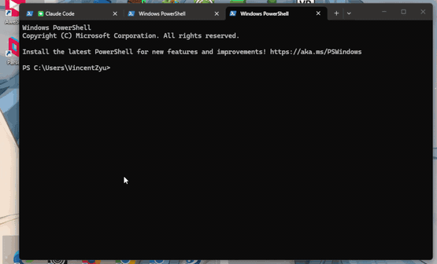

# Winload 

> 轻量级实时终端网络流量监控工具，灵感来自 Linux 的 nload。

> **[📖 English](readme.md)**
> **[📖 简体中文(大陆)](readme.zh-cn.md)**
> **[📖 繁體中文(台灣)](readme.zh-tw.md)**
> **[📖 日本語](readme.jp.md)**
> **[📖 한국어](readme.ko.md)**

[](https://github.com/VincentZyuApps/winload)
[](https://gitee.com/vincent-zyu/winload)

[](https://github.com/VincentZyuApps/winload/releases)
[](https://github.com/VincentZyuApps/winload/releases)
[](https://github.com/VincentZyuApps/winload/releases)
[](https://github.com/VincentZyuApps/winload/releases)

[](https://pypi.org/project/winload/)
[](https://www.npmjs.com/package/@vincentzyuapps/winload)
[](https://crates.io/crates/winload)

[](https://scoop.sh/#/apps?q=%22https%3A%2F%2Fgithub.com%2FVincentZyuApps%2Fscoop-bucket%22&o=false)
[](https://aur.archlinux.org/packages/winload-rust-bin)
[](https://github.com/VincentZyuApps/winload/releases)
[](https://github.com/VincentZyuApps/winload/releases)
[](https://github.com/VincentZyuApps/homebrew-tap/blob/main/Formula/winload.rb)

> **[📖 构建文档](.github/workflows/build.zh-cn.md)**

## 🚀 简介
`Winload` 是一个直观的终端网络流量监控工具。最初为 Windows 打造，弥补 `nload` 在 Windows 上的空白，现已支持 Linux 和 macOS。

## 🙏 致谢
Winload 的灵感来自 Roland Riegel 的经典 「[nload](https://github.com/rolandriegel/nload)」 项目，感谢原作者的创意与体验。
https://github.com/rolandriegel/nload

## ✨ 主要特性
- **双实现版本**
	- **Rust 版**: 快速、内存安全、单静态二进制文件，适合日常监控。
	- **Python 版**: 易于修改和扩展，适合原型开发或集成。
- **跨平台**: Windows、Linux、macOS（x64 & ARM64）。
- **实时可视化**: 实时上行/下行流量图和吞吐量统计。
- **简洁界面**: 干净的 TUI，沿袭 nload 的人体工程学设计。

## 📊 性能基准测试
> ⚡ Winload (Rust) 实现 **~10ms 启动速度** 和 **<5MB 二进制体积**，在效率上显著优于 Python 并与 C++ nload 相当。


## 🔧 从源码运行

### Python
```bash
git clone https://github.com/VincentZyuApps/winload.git
# 或从 Gitee 克隆（中国大陆更快）：
# git clone https://gitee.com/vincent-zyu/winload.git
cd winload/py
pip install -r requirements.txt
python main.py
```

### Rust
```bash
git clone https://github.com/VincentZyuApps/winload.git
cd winload/rust
cargo run --release
cargo run --release -- --help    # 显示帮助
cargo run --release -- --version # 显示版本
```

## 🐍 Python 版本安装
> 💡 **实现说明**：仅 PyPI 和 GitHub/Gitee 源代码是 Python 版本。  
> 仅 Cargo 提供 Rust 源码供本地编译。  
> 所有其他包管理器（Scoop、AUR、npm、APT、RPM）及 GitHub Releases 均提供 **Rust 二进制文件**。
### Python (pip)
```bash
pip install winload
# 推荐使用 uv：
# https://docs.astral.sh/uv/getting-started/installation/
# https://gitee.com/wangnov/uv-custom/releases
uv venv --python 3.13
uv pip install winload
uv run winload
uv run python -c "import shutil; print(shutil.which('winload'))"
```

## 📥 Rust 版本安装（推荐）
### npm (跨平台)
```bash
npm install -g @vincentzyuapps/winload
npm list -g @vincentzyuapps/winload
# 在 Windows 上使用 win-nload 以避免与 System32\winload.exe 冲突
# 在 Linux/macOS 上，winload 和 win-nload 均可使用
# 或直接使用 npx
npx @vincentzyuapps/winload
```
> ⚠️ 旧包名 `winload-rust-bin` 已弃用，请使用 `@vincentzyuapps/winload`。改用 scoped 包名是为了兼容 [GitHub Packages](https://github.com/features/packages) 规范。

> 包含 6 个预编译二进制文件：x86_64 & ARM64 版本，支持 Windows、Linux 和 macOS。

### Cargo (源码编译)
```bash
cargo install winload
cargo install --list
```
### Windows (Scoop)
> 📄 [Scoop Bucket (GitHub)](https://github.com/VincentZyuApps/scoop-bucket/blob/main/bucket/winload.json)
> 📄 [Scoop Bucket (Gitee)](https://gitee.com/vincent-zyu/scoop-bucket/blob/main/bucket/winload.json)
```powershell
scoop bucket add vincentzyu https://github.com/VincentZyuApps/scoop-bucket
# 或从 Gitee 克隆：
# scoop bucket add vincentzyu https://gitee.com/vincent-zyu/scoop-bucket
scoop update   # optional: 提前手动更新 bucket 列表
scoop install winload
# 执行二进制文件
win-nload
Get-Command win-nload # Powershell
where win-nload # CMD
```
> 💡 推荐使用 [Windows Terminal](https://github.com/microsoft/terminal) 而非旧版 Windows Console，以获得正确的中文字符渲染和更好的 TUI 体验。
> ```powershell
> scoop bucket add versions
> scoop install windows-terminal-preview
> wtp
> ```
> 💡 **所有构建均需 Windows 10+**（Rust 1.77+ 已放弃支持 Windows 7/8）。Scoop 和 npm 默认提供 **x86_64** 和 **ARM64** 的 **MSVC 无 Npcap** 构建，因此普通安装不需要 `wpcap.dll`。如需使用 `--npcap`，请安装 Npcap，并从 [GitHub Releases](https://github.com/VincentZyuApps/winload/releases) 下载 `*-npcap` 构建。

### Arch Linux (AUR):
```bash
paru -S winload-rust-bin
which winload
```

### Linux (一键安装脚本)
> 支持 Debian/Ubuntu 及其下游 —— Linux Mint、Pop!_OS、Deepin、统信 UOS 等 (apt)

> 支持 Fedora/RHEL 及其下游 —— Rocky Linux、AlmaLinux、CentOS Stream 等 (dnf)
```bash
curl -fsSL https://raw.githubusercontent.com/VincentZyuApps/winload/main/docs/install_scripts/install.sh | bash
which winload
```
> 📄 [查看安装脚本源码](https://github.com/VincentZyuApps/winload/blob/main/docs/install_scripts/install.sh)

**🇨🇳 Gitee 镜像（大陆地区下载更快）：**
```bash
curl -fsSL https://gitee.com/vincent-zyu/winload/raw/main/docs/install_scripts/install_gitee.sh | bash
which winload
```
> 📄 [查看 Gitee 安装脚本源码](https://gitee.com/vincent-zyu/winload/blob/main/docs/install_scripts/install_gitee.sh)

> ⚠️ 以上两个 `curl ... | bash` 安装脚本支持 **x86_64 / aarch64** 架构上使用 **apt**（Debian/Ubuntu）、**dnf**（Fedora/RHEL）或 **Termux**（Android）的系统。其他平台请使用 **npm**（`npm install -g @vincentzyuapps/winload`）或 **Cargo**（`cargo install winload`）安装。

### macOS / Linux（Homebrew）
> 📄 [Homebrew Formula (GitHub)](https://github.com/VincentZyuApps/homebrew-tap/blob/main/Formula/winload.rb)
> 📄 [Homebrew Formula (Gitee)](https://gitee.com/vincent-zyu/homebrew-tap/blob/main/Formula/winload.rb)
```bash
brew tap vincentzyuapps/tap
# 或从 Gitee（手动克隆 tap）：
# git clone https://gitee.com/vincent-zyu/homebrew-tap.git "$(brew --prefix)/Library/Taps/vincentzyuapps/homebrew-tap"
brew update && brew install winload
which winload
```
> 💡 Homebrew 支持 **macOS**（Intel 和 Apple Silicon）和 **Linux**（x86_64 和 ARM64）。

<details>
<summary>手动安装</summary>

**DEB (Debian/Ubuntu):**
```bash
# 从 GitHub Releases 下载最新 .deb 包
sudo dpkg -i ./winload*.deb
# 或使用 apt（自动处理依赖）
sudo apt install ./winload*.deb
which winload
```

**RPM (Fedora/RHEL):**
```bash
sudo dnf install ./winload*.rpm
which winload
```

**或者直接从 [GitHub Releases](https://github.com/VincentZyuApps/winload/releases) 下载二进制文件。**

</details>

## ⌨️ 用法

```bash
winload              # 监控所有活跃网络接口
winload -t 200       # 设置刷新间隔为 200ms
winload -d "Wi-Fi"   # 启动时定位到 Wi-Fi 网卡
winload --title      # 顶部标题显示为 "winload <版本号>"
winload --title "我的监视器" # 使用自定义顶部标题
winload --title ""   # 保持默认设备标题
winload -e           # 启用 emoji 装饰 🎉
winload --npcap      # 捕获 127.0.0.1 回环流量 (Windows，需安装 Npcap)
```

### 参数选项

| 参数 | 说明 | 默认值 |
|------|------|--------|
| `-t`, `--interval <MS>` | 刷新间隔（毫秒） | `500` |
| `-a`, `--average <SEC>` | 平均值计算窗口（秒） | `300` |
| `-d`, `--device <NAME>` | 默认设备名（模糊匹配） | — |
| `--title [TITLE]` | 覆盖顶部标题：不带值时显示 `winload <版本号>`；空字符串保持默认设备标题 | — |
| `-e`, `--emoji` | 启用 emoji 装饰 🎉 | 关闭 |
| `-U`, `--unicode` | 使用 Unicode 方块字符绘图（█▓░·） | 关闭 |
| `-u`, `--unit <UNIT>` | 显示单位：`bit` 或 `byte` | `bit` |
| `-b`, `--bar-style <STYLE>` | 状态栏样式：`fill`、`color` 或 `plain` | `fill` |
| `--in-color <HEX>` | 下行图形颜色，十六进制 RGB（如 `0x00d7ff`） | 青色 |
| `--out-color <HEX>` | 上行图形颜色，十六进制 RGB（如 `0xffaf00`） | 金色 |
| `-m`, `--max <VALUE>` | 固定 Y 轴最大值（如 `10M`、`1G`、`500K`）—— *与 `--smart-max` 冲突* | 自动 |
| `--smart-max [SECS]` | 智能自适应 Y 轴上限：流量尖峰后自动指数回落，波形更生动（半衰期，秒，默认 10s）—— *与 `--max` 冲突* | 关闭 |
| `-n`, `--no-graph` | 隐藏图形，仅显示统计信息 | 关闭 |
| `--hide-separator` | 隐藏分隔线（等于号一行） | 关闭 |
| `--no-color` | 禁用所有 TUI 颜色（单色模式） | 关闭 |
| `--npcap` | **[Windows Rust Only]** 通过 Npcap 捕获回环流量（推荐） | 关闭 |
| `--debug-info` | 打印网络接口调试信息后退出 | — |
| `-h`, `--help` | 打印帮助（`--help --emoji` 可查看 emoji 版！） | — |
| `-V`, `--version` | 打印版本号 | — |

> **Y 轴缩放模式** —— 以下三种场景互斥：
>
> | 模式 | 参数 | 行为 |
> |------|------|------|
> | **固定最大值** | `--max <VALUE>` | Y 轴锁定为指定值（如 `10M`、`1G`）。 |
> | **智能最大值** | `--smart-max [SECS]` | Y 轴自适应：流量突增时立即跳升，随后平滑衰减（指数衰减，默认半衰期 10 秒）。 |
> | **历史峰值** | *（都不加）* | Y 轴跟随各指标的历史最大值 —— 这是默认行为。 |
>
> ⚠️ `--max` 与 `--smart-max` **相互冲突** —— 只能二选一。

### 快捷键

| 按键 | 功能 |
|------|------|
| `←` / `→` 或 `↑` / `↓` | 切换网络设备 |
| `F3` | 切换调试信息界面（Minecraft 风格） |
| `=` | 切换分隔线的显示/隐藏 |
| `c` | 切换颜色开/关 |
| `q` / `Esc` | 退出 |

## 🪟 Windows 回环流量 (127.0.0.1)

Windows 无法通过标准 API 报告回环流量——这是 [Windows 网络栈的功能缺失](docs/win_loopback.zh-cn.md)。

**要在 Windows 上捕获回环流量**，使用 `--npcap` 参数：

```bash
winload --npcap
```

需要安装 [Npcap](https://npcap.com/#download)，安装时勾选 "Support loopback traffic capture"。

> 我之前尝试过直接轮询 Windows 自带的 `GetIfEntry` API，但 loopback 的计数器始终为 0——loopback 伪接口背后根本没有 NDIS 驱动在计数。该代码路径已被移除。

> 📖 深入了解 Windows 回环为何失效，请阅读 [docs/win_loopback.zh-cn.md](docs/win_loopback.zh-cn.md)

在 Linux 和 macOS 上，回环流量开箱即用，无需额外参数。

## 🖼️ 预览
#### Python 版预览


#### Rust 版预览


##### Rust 版预览 GIF


##### 终端录制
<a href="https://asciinema.org/a/1030894?startAt=30" target="_blank"></a>

> ↑ 使用 [asciinema](https://github.com/asciinema/asciinema) 录制

## 📦 依赖

### Python 版本

| 包 | 版本 | 说明 |
|:---|:---|:---|
| [](https://python.org/) | 3.13.11 | 编程语言 |
| [](https://github.com/giampaolo/psutil) | ≥7.0 | 进程和系统工具 |
| [](https://github.com/zhirui2020/windows-curses) | ≥2.0 | Windows curses 支持 |

### Rust 版本

| 包 | 版本 | 说明 |
|:---|:---|:---|
| [](https://www.rust-lang.org/) | 1.93.0 | 编程语言 |
| [](https://github.com/ratatui-org/ratatui) | 0.29 | 终端 UI 框架 |
| [](https://github.com/crossterm-rs/crossterm) | 0.28 | 跨平台终端库 |
| [](https://github.com/GuillaumeGomez/sysinfo) | 0.32 | 系统信息库 |
| [](https://github.com/clap-rs/clap) | 4 | 命令行参数解析器 |
| [](https://github.com/pcap-parser/pcap) | 2 | 数据包捕获（可选，Windows） |
